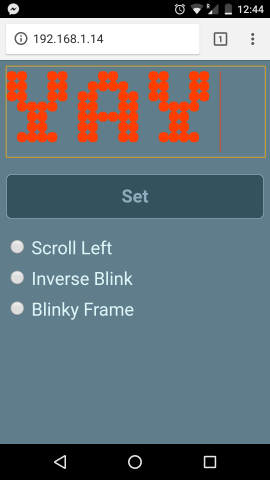

# ESP32 LED Effects Server

This software provides a simple web-based interface for driving 8x8 MAX7219-based LED Matrices on an ESP32 microcontroller. I'm using the Geekworm ESP32-DevKit (http://www.raspberrypiwiki.com/index.php/ESP32-DevKit).

Cheap modules can be found on various online marketplaces like eBay, DealExtreme or Aliexpress:
http://www.dx.com/s/MAX7219?cateId=0&cateName=All%20Categories
https://www.ebay.com/sch/i.html?_from=R40&_trksid=p2050601.m570.l1313.TR0.TRC0.H0.XMAX7219.TRS0&_nkw=MAX7219&_sacat=0

These devices can be controlled through a daisy-chained SPI interface.

**What works**

* Simple web interface.
* Websocket interface. (Uses protobuf for the moment, see proto/ws.proto but might implement JSON or something simple later.)
* Multiple effects are available (scroll left, inverse, blinking frame).
* Effects are mirrored as asterisks on the UART console.
* Connects to a WiFi network.
* Advertises itself using mDNS.
* (*not tested*) SPI interface works with transfers happening but I was not able to test with an actual module as the package got lost in transit...

**Libraries used**

ESP32-IDF - https://github.com/espressif/esp-idf.git
Mongoose HTTP Server - https://github.com/cesanta/mongoose
NanoPB - https://github.com/nanopb/nanopb
Monochrome bitmap fonts - https://github.com/dhepper/font8x8

**Wiring**

Please be very cautious. I do not take any responsibility for ruined hardware. I was not able to test with an actual LED matrix yet so please double-check yourself if these pairings make any sense to you.

The SPI interface is initialized in the code with the following default values used:
```
#define DEFAULT_MOSI_PIN    GPIO_NUM_13
#define DEFAULT_MISO_PIN    GPIO_NUM_12
#define DEFAULT_CLK_PIN     GPIO_NUM_14
#define DEFAULT_CS_PIN      GPIO_NUM_15
```
MISO is not actually needed in this case as it is not used by the device.

ESP32 Pin     | LED Module PINS
--------------|----------------
3V3           | VCC
GND           | GND
IO13 (MOSI)   | DIN
IO15 (CS)     | CS
IO14 (CLK)    | CLK

**Building**

Set up ESP-IDF as outlined here: https://esp-idf.readthedocs.io/en/latest/get-started/index.html#introduction

Then build and flash the actual binaries:
```
make menuconfig # set your WiFI SSID and password under Wifi Client configuration
make         
make flash
```

**Running**

After booting the ESP32 will attempt to connect to your WiFi network. The IP address assigned to your device will be logged to the serial console (*make monitor*) with a line starting with "Got IP: xxx.xxx.xxx.xxx".

As the effects are mirrored on the UART console the amount of lines logged might be overwhelming. You can disable this under "LED Server Configuration" using the "Mirror currently displayed effects on the UART console." option.

You can also use any tool that can discover host/services advertised through mDNS to access the device such as Service Browser for Android (https://play.google.com/store/apps/details?id=com.druk.servicebrowser) but anything compatible will do.

The HTTP interface itself is rather simple and listens on port 80.



The bitmap font is actually generated from the font8x8 header files.

**License**

The MIT License (MIT)

Copyright (c) 2018 Gabriel Miklos

Permission is hereby granted, free of charge, to any person obtaining a copy of this software and associated documentation files (the "Software"), to deal in the Software without restriction, including without limitation the rights to use, copy, modify, merge, publish, distribute, sublicense, and/or sell copies of the Software, and to permit persons to whom the Software is furnished to do so, subject to the following conditions:

The above copyright notice and this permission notice shall be included in all copies or substantial portions of the Software.

THE SOFTWARE IS PROVIDED "AS IS", WITHOUT WARRANTY OF ANY KIND, EXPRESS OR IMPLIED, INCLUDING BUT NOT LIMITED TO THE WARRANTIES OF MERCHANTABILITY, FITNESS FOR A PARTICULAR PURPOSE AND NONINFRINGEMENT. IN NO EVENT SHALL THE AUTHORS OR COPYRIGHT HOLDERS BE LIABLE FOR ANY CLAIM, DAMAGES OR OTHER LIABILITY, WHETHER IN AN ACTION OF CONTRACT, TORT OR OTHERWISE, ARISING FROM, OUT OF OR IN CONNECTION WITH THE SOFTWARE OR THE USE OR OTHER DEALINGS IN THE SOFTWARE.
